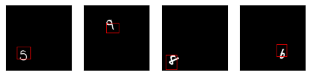
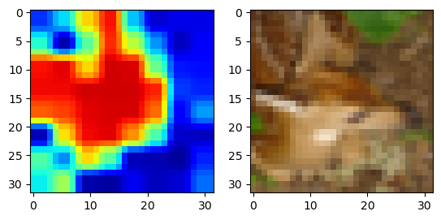

# Lab 1 - CNNs

This laboratory is about Convolutional Neural Networks and it is divided in three parts:

1. We will introduce the basic experimental pipeline, introducing WandB and implement a simple MLP model for image classification on MNIST dataset.
2. we will then implement a ResNet model for image classification on MNIST and CIFAR-10 datasets, reproducing some of the results from the original paper. 
3. In the last part we will perform Object Localization and visualize Class Activation Maps of the previously trained model.

The procedure and the results are shown in this [notebook](Lab1-CNNs.ipynb). 
A WandB report of ResNet results is available on [here](https://api.wandb.ai/links/dla-darcio/tkjq72ic).

## Project Structure 

```
lab-1/
│
├── artifacts/ - default directory for storing downloaded checkpoints from Weights & Biases
├── data/ - directory for storing input data
├── wandb/ - default directory for local logging with Weights & Biases
│
├── models/ - directory of developed models
│   ├── mplp.py - Implementation of a simple MLP
│   └── resnet.py - Implementation of AlexNet
│
├── data_loader.py - anything about data loading goes here
│   └── SubsetDataset - Dataset wrapper for Subset
│
├── test.py - evaluation of trained models 
├── train.py - main script to start training
│
├── trainer.py - implementation of training procedure
│   └── Trainer - class for training & validation of models
│   
└── utils.py -  utility functions
```

## Requirements 

- python 3.10
- pytorch 2.0.0
- torchvision 0.15.0
- wandb 0.15.0
- jupyterlab
- ipython
- matplotlib
- scikit-learn 1.2.2
- tqdm
- numpy

## Usage
For training, run

```bash
python train.py --data <path/to/dataset> --batch_size <batch_size> --device <cpu | cuda | cuda:device> --<checkpoints | --no-checkpoints> --optim <optimizer> --epochs <epochs>  --lr <learning_rate> --momentum <momentum> --weight_decay <weight_decay> 
                --num_layers <num_layers> --num_channels <num_channels> --<residual | no-residual> --<batch_norm | no-batch_norm> --residual_type <residual_type>
```
To evaluate a trained model, run

```bash
python test.py --data <path/to/dataset> --batch_size <batch_size> --device <cpu | cuda | cuda:device> --checkpoint_url <url/to/wandb>
```

## Results

### Exercise 1 - Residual Networks
We implemented a ResNet model and trained it on MNIST and CIFAR-10 datasets. We show that the ResNet model is able to achieve better results than the non-residual counterpart.

We also show that the performance of non-residual models degrades after a certain number of layers. Conversely, residual networks' performance increases with the number of layers, but it saturates due to overfitting  after a certain number of layers.

| # Layers | Residual | Parameters | Accuracy  |
|:--------:|:--------:|:----------:|:---------:|
|    20    |   Yes    |    270K    |   0.872   |
|    20    |    No    |    270K    |   0.867   |
|    56    |   Yes    |    835K    | **0.900** |
|    56    |    No    |    835K    |   0.839   |

### Exercise 2.2 - Object Localization
We fully-convolutionalized the ResNet model and trained it on MNIST dataset. We show that this model can effectively object localization, even if it was trained only for classification.



### Exercise 2.3 - Class Activation Maps
We implemented Class Activation Maps (CAM) for ResNet model. We show that the Class Activation Maps are able to highlight the most important regions of the image for the classification task.



