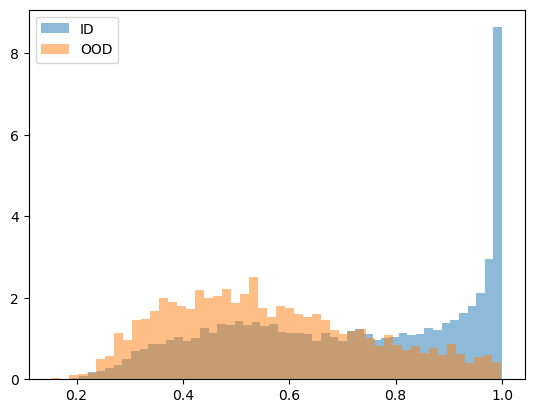
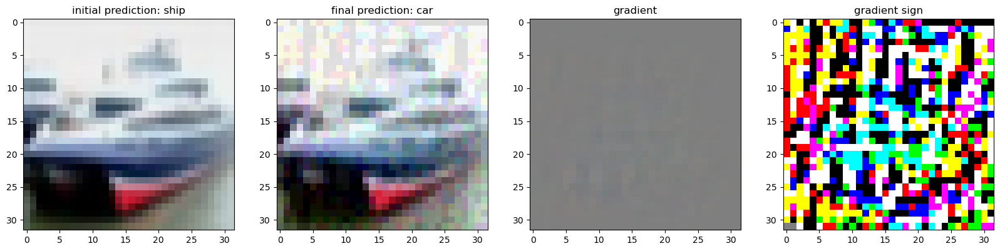
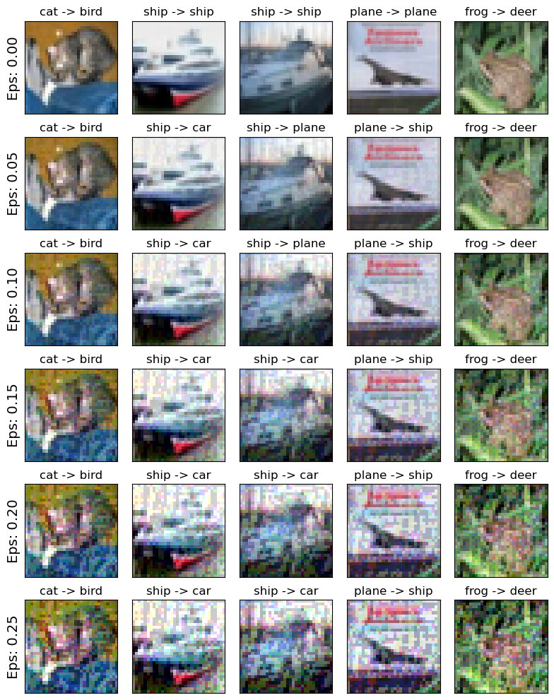
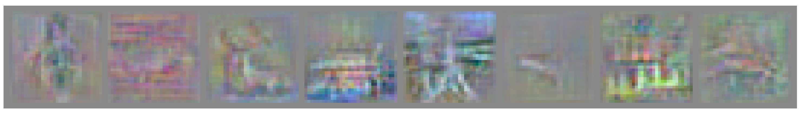

# Lab 4 - Adversarial Training

This laboratory is an introduction to Out Of Distribution Detection and Adversarial Training.
It is divided in three parts:
1. Out Of Distribution Detection: Trained a model to detect if an image is coming from CIFAR-10 (In-Distribution) or a subset of CIFAR-100 including only 5 classes representing humans (Out-Of-Distribution).
2. Adversarial Attacks: Showed how to generate adversarial examples using the Fast Gradient Sign Method (FGSM), and trained a robust model using adversarial training.  
3. JARN: Implemented JARN (Jacobian Adversarially Regularized Networks for Robustness), a method to train robust models using adversarial training.

An implementation of all three parts can be found in the [Jupyter Notebook](./Lab4_OOD.ipynb).

## 1. Out Of Distribution Detection

## 2. Adversarial Attacks

## 3. JARN

