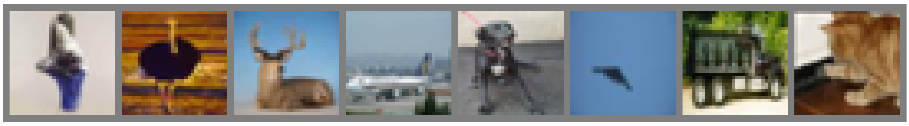

# Lab 4 - Adversarial Training

This laboratory is an introduction to Out Of Distribution Detection and Adversarial Training.
It is divided in three parts:
1. Out Of Distribution Detection: Trained a model to detect if an image is coming from CIFAR-10 (In-Distribution) or a subset of CIFAR-100 including only 5 classes representing humans (Out-Of-Distribution).
2. Adversarial Attacks: Showed how to generate adversarial examples using the Fast Gradient Sign Method (FGSM), and trained a robust model using adversarial training.  
3. JARN: Implemented JARN (Jacobian Adversarially Regularized Networks for Robustness), a method to train robust models using adversarial training.

[](./Lab4_OOD.ipynb)

An implementation of all three parts can be found in the [Jupyter Notebook](./Lab4_OOD.ipynb).

## 1. Out Of Distribution Detection

We used the max logits and temperature-scaled softmax over the ID and OOD logits to detect if an image is coming from CIFAR-10 or CIFAR-100.


## 2. Adversarial Attacks

We used the Fast Gradient Sign Method (FGSM) to generate adversarial examples and trained a robust model using adversarial training.


## 3. JARN

[](https://wandb.ai//dla-darcio/lab-4-adversarial/reports/Lab4-Adversarial-Learning--Vmlldzo0ODA5OTk1)

We trained a model using JARN and compared it to a model trained using only the FGSM adversarial training method seen in the previous exercise (FGSM-AT).

Adversarial examples are more salient than FGSM-AT, but the FSGM-AT model is more robust to adversarial examples.

This is an example of the Jacobian of the input for the JARN-AT1 model, compared to the original images.




### Usage


```bash
python train.py --optional_arguments
```

```
python test.py --optional_arguments
```

You can see the optional arguments by running `python train.py --help` or `python test.py --help`.

### Project structure

```
lab-4/
│
├── artifacts/ - default directory for storing downloaded checkpoints from Weights & Biases
├── data/ - directory for storing input data
├── wandb/ - default directory for local logging with Weights & Biases
│
├── models/ - directory of developed models
│   ├── cnn.py: contains convolutional backbones for all exercises
│       ├── BaseCNN: implementation of a simple CNN model, the same used in the flipped activity
│       └── CNN: a more customized CNN model, used in the JARN exercise
│
├── fsgm.py - simple implementation of FGSM and utility functions to generate adversarial examples
│
├── test.py - evaluation of trained models 
├── train.py - main script to start training
│
├── trainer.py - implementation of training procedure
│   └── Trainer - class for training & validation of models
│   
└── utils.py -  utility functions
```
